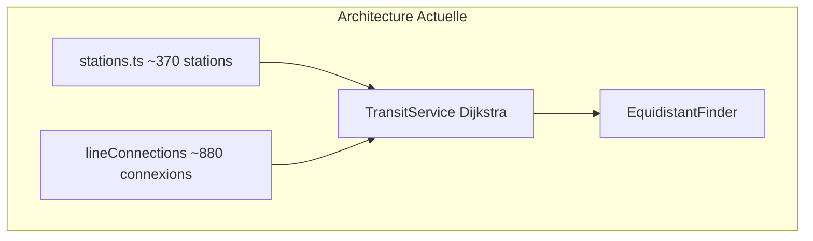

# Extension Le Middle à la Petite Couronne IDF

## Contexte actuel

L'application utilise des données statiques de ~370 stations (Metro + RER partiel) avec un algorithme Dijkstra interne pour calculer les itinéraires. Le rayon de recherche est limité à 1km autour des stations.



## Ce qui doit être ajouté

### Nouvelles lignes et stations estimées

| Type | Lignes | Stations estimées |

|------|--------|-------------------|

| Tramway | T1, T2, T3a, T3b, T5, T6, T7, T8 | ~120 stations |

| Transilien | L, J, H, N, P, U (petite couronne) | ~80 stations |

| RER complémentaire | A, B, C, D, E (stations manquantes) | ~40 stations |

| **Total** | | **~240 nouvelles stations** |

### Fichiers impactés

- [`frontend/src/data/stations.ts`](frontend/src/data/stations.ts) - Données frontend
- [`backend/src/data/stations.ts`](backend/src/data/stations.ts) - Données backend + connexions
- [`backend/src/services/TransitService.ts`](backend/src/services/TransitService.ts) - Ajustement rayon recherche

---

## Plan d'implémentation

### Phase 1 : Préparation des données

1. **Collecter les données de stations** depuis les sources officielles IDFM/RATP :

   - Coordonnées GPS de chaque station
   - Noms officiels
   - Lignes desservies
   - Temps de correspondance moyen

2. **Structurer les données** dans le format existant :
```typescript
// Exemple format station Tramway
{ 
  id: 't1-bobigny-picasso', 
  name: 'Bobigny - Pablo Picasso', 
  coordinates: { lat: 48.9065, lng: 2.4495 }, 
  lines: ['T1', '5'], // Correspondance Metro 5
  walkingTimeMinutes: 2 
}
```


### Phase 2 : Enrichissement des données

3. **Ajouter les couleurs des nouvelles lignes** dans `METRO_LINE_COLORS` :
```typescript
// Couleurs Tramway officielles RATP
'T1': '#006CB8', 'T2': '#CF5C9D', 'T3a': '#F39C12',
'T3b': '#009B77', 'T5': '#662483', 'T6': '#E4312B',
'T7': '#8D5E2A', 'T8': '#A0512D',
// Couleurs Transilien
'L': '#7B4339', 'J': '#CEAE00', 'H': '#8D5E2A',
'N': '#00A88F', 'P': '#F3A4BA', 'U': '#A90050'
```

4. **Définir les connexions entre stations** (temps de trajet inter-stations ~2-3 min pour tramway, 3-5 min pour Transilien)

### Phase 3 : Ajustements techniques

5. **Élargir le rayon de recherche** dans [`TransitService.ts`](backend/src/services/TransitService.ts) :

   - Passer de 1km à 1.5-2km pour la banlieue (stations plus espacées)
   - Ou adapter dynamiquement selon la densité de stations

6. **Ajouter le type de transport "tramway"** dans les types :
```typescript
type: 'walk' | 'metro' | 'rer' | 'transilien' | 'tramway'
```


### Phase 4 : Tests et validation

7. **Tester des scénarios typiques** :

   - Montreuil ↔ La Défense
   - Saint-Denis ↔ Créteil
   - Boulogne ↔ Pantin

---

## Sources de données recommandées

- **IDFM Open Data** : https://data.iledefrance-mobilites.fr/
- **RATP Open Data** : https://data.ratp.fr/
- **Fichiers GTFS** : Contiennent toutes les stations avec coordonnées

## Estimation de travail

| Tâche | Effort |

|-------|--------|

| Collecte et formatage données Tramway | 2-3h |

| Collecte et formatage données Transilien | 2-3h |

| Complétion données RER | 1-2h |

| Définition des connexions (~300+) | 3-4h |

| Ajustements code (rayon, types) | 1h |

| Tests et validation | 2h |

| **Total estimé** | **11-15h** |

## Alternative automatisée (optionnelle)

Pour accélérer la collecte, on pourrait créer un script qui parse les fichiers GTFS IDFM et génère automatiquement les données TypeScript. Cela réduirait significativement le temps de collecte manuelle.